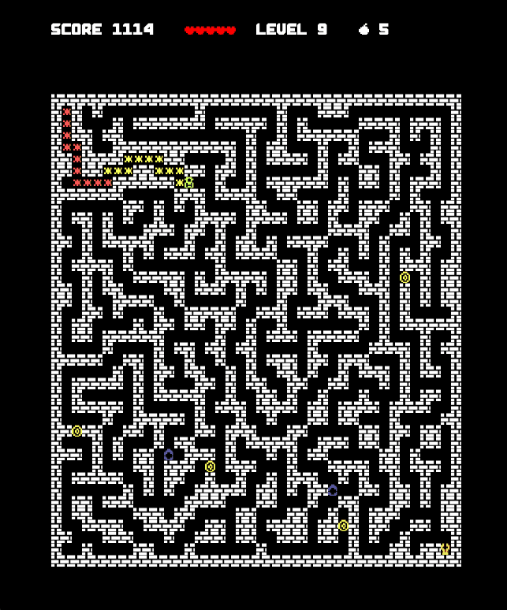
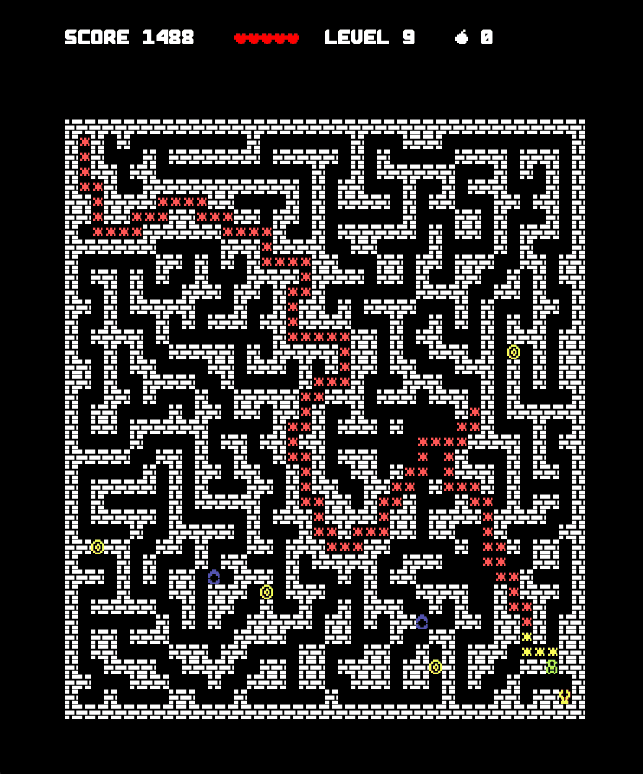
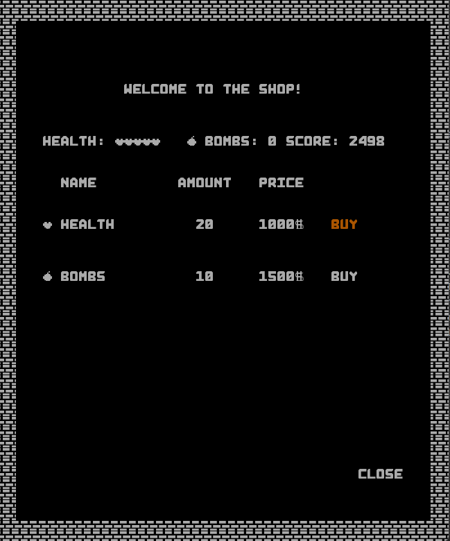
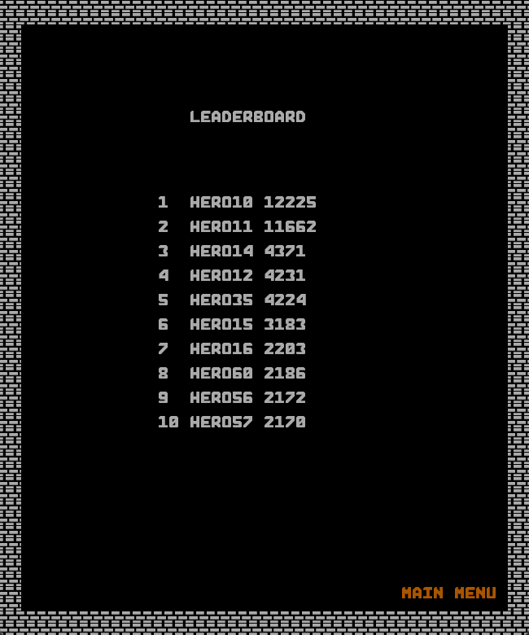
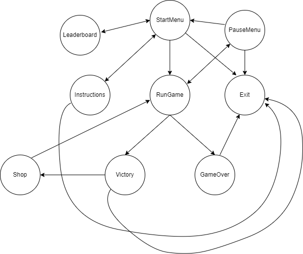

# LDTS_T01_G03 - Maze Conqueror

## Game Description

> The game consists of solving procedurally generated mazes as fast as possible while avoiding any obstacles in your path. Obstacles such as
> complicated paths, enemies and the impending red path, which stops backtracking, all make this exciting maze solving experience unique.

> This project was developed by *Eduardo Correia* (*up201909914*@fc.up.pt), *José Carvalho* (*up202005827*@fc.up.pt) and *Alberto Serra* (*up202103627*@fe.up.pt) for LDTS 2021-22.

## Screenshots / Gifs

The following screenshots illustrate and gifs the general look of our game, as well as the divergent functionalities:

### Start Menu

### Playing the game

### Pause menu

### Finishing the game

### Shop Menu

### Leaderboard Menu

### Instructions Menu

## Implemented Features

### Main Menu

> This section is in regard to the menu the player sees and interacts with when he starts up the game.

- **Start Game** - Allows the player to start the game.
- **Instructions** - Opens a new screen with info on how to play the game.
- **Exit** - Closes the game.

### Core Game

> This section details the features of the core gameplay.

- **Maze Generation** - Creates a new random maze with a reachable ending everytime the game is started.
- **Movement** - Allows the player to move the hero character.
- **Collision** - Prevents the player from phasing through unwanted elements of the game.
- **Trophy** - Reachable goal that dictates the ending of the game.
- **Pathing** - Highlights the path that the player took.
- **Hazardous Pathing** - Gradually transforms the path that the player took into a red path which, on contact, deals
  damage to the player.
- **Health** - The player's hit points, enables the player to take damage, and on reaching 0, finishes the game.
- **Pause** - Allows the player to pause the game.
- **Multithreaded Input** - The game does not stop and wait for player input.
- **Refactored Menus** - Hand-made menus that change the state of the game. These include, starting, pausing and finishing the game. Changed from default lanterna menu's.
- **Points** - The faster you complete the maze, the higher your points. Points are also acquired whenever you enter a new empty tile or pickup a coin.
- **Coins** - Randomly generated elements which, on contact give the player more points.
- **Portals** - Randomly generated elements which, on contact teleport the player to another portal on the maze.
- **Continue Playing** - Continue playing after completing the first maze (with a new randomly generated maze) in order
  to increase your total points. The game increases in difficulty after every level.

### Pause Menu

> This section details the features in regard to the pause menu.

- **Resume Game** - Allows the player to resume the game.
- **Restart** - Allows the player to restart the game.
- **Exit** - Closes the game.

### Game Over/Victory Menu

> This section details the features in regard to the Game Over/Victory menu. 
- **Continue** - Opens the shop to restock items. And allows the player to continue playing.
- **Main Menu** - Allows the player to return to the main menu.
- **Exit** - Allows the player to exit the game.

### Leaderboard Menu

> This section details the features in regard to the Leaderboard menu.
- **Leaderboard** - Highscore list that shows the best players.
- **Main Menu** - Allows the player to return to the main menu.

### Shop Menu

> This section details the features in regard to the Shop menu.
- **Shop** - Allows the player to restock resources such as bombs and health.
- **Unlockable Items** - Shop gains new items available for purchase after completing a certain amount of levels
- **Main Menu** - Allows the player to return to the main menu.

### Planned Features

> This section details the planned features for the game as a whole, that were not implemented.

- **Enemies** - Enemies with random movement that deal contact damage. This feature was not implemented due to the fact
that it conflicted with the gameplay we set ought to create. Enemies would only add a chaotic factor which would not be healthy to the project as a whole.

------
## Design

### General project development philosophy

#### Test Driven Mentality

 When possible, the project was designed with the test-driven development process, which consists on software requirements being converted to test cases before software is fully developed, a
 and tracking all software development by repeatedly testing the software against all test cases.

#### The four pillars of object-oriented programming

In general, the project was designed with the four pillars of object-oriented programming in mind :

- **Encapsulation** - Encapsulation is accomplished when each object maintains a private state, inside a class. Other objects can not access this state directly, instead, they can only invoke a list of public functions. The object manages its own state via these functions and no other class can alter it unless explicitly allowed.
- **Abstraction** - abstraction is an extension of encapsulation. It is the process of selecting data from a larger pool to show only the relevant details to the object.
- **Inheritance** - Inheritance is the ability of one object to acquire some/all properties of another object. With inheritance, reusability is a major advantage.
- **Polymorphism** - Polymorphism gives us a way to use a class exactly like its parent so there is no confusion with mixing types. This being said, each child sub-class keeps its own functions/methods as they are.

### The Core Game Loop

#### Problem in Context

The problem in question was figuring out what the game was currently doing and reacting by running code accordingly.

**The Pattern**

The Game class, responsible for all the interaction between classes, is defined by a **_Singleton
Pattern_**, ensuring that the class only has one instance and provide a global point to access it.

**Implementation**

To develop the project we decided that we were going to create a state machine for our main loop and use it to change the
program's behaviour.  We can switch to a different state of the application by changing the `gameState` variable.

Our State Machine relies on the game state or player actions to determine which state to go to next. The Main Menu
functions as a default state where many actions can be performed. These can depend on previous and current
inputs, as well as states.

**Consequences**

The use of the **_State Pattern_** in the current design allows the following benefits:

- The several states that represent the different game states become explicit in the code, instead of relying on a
  series of flags.
- A well organized, readable code.
- Minimal conditional complexity.

**Maze Pattern**

The maze interface and class is a pivotal object in the application, being the arena where all elements will appear and
interact. The **_Singleton Pattern_** ensures that this class only has one instance and provide a global access point.

These classes can be found in the following files:

- [Game](https://github.com/FEUP-LDTS-2021/ldts-project-assignment-g0103/blob/main/src/main/java/game/Game.java)
- [GameInterface](https://github.com/FEUP-LDTS-2021/ldts-project-assignment-g0103/blob/main/src/main/java/game/GameInterface.java)

------

### Shop

**Objective**

The shop was designed with the objective to be as dynamic as possible for future development.
Every time a new item is added to the shop the menu will adjust adding 
every element to the respective position relatively to one another.

**Usage**

Every action is possible with a single call of self-explanatory functions such
as `sell()`, `increaseStock()`and`generalReStock()`.

Every item in the shop can have a custom `icon`, `name`,`price` and an optional `maximum value`.

The selling intention will be automatically verified and only be possible if the player meets the requirements
intrinsically liked to the desired items, for example to get an extra heart the player must have the correct 
amount of currency and the current amount of this hp should be less than the permitted set max amount.

The functions present in the shop also allow for automatic interactions, for example in our game at level 10
a new item will be available to purchase and the previous listed item will see their amount restocked.

**A look into the future**

Even though this class does not follow a specific pattern it was created with the intention to have a clear
and easy to understand code to allow ,as said before, further development and use.

These classes can be found in the following files:
- [ShopHandler](https://github.com/FEUP-LDTS-2021/ldts-project-assignment-g0103/blob/main/src/main/java/handler/ShopHandler.java)

------

#### Figuring out how to represent elements in the game.

**Problem in Context**

In our game, multiple elements like walls, paths and the player character exist, and we had to figure out a way to
represent them in a structured efficient way.

**Pattern**

The two main patterns applied specifically to the multiple elements were the **_Strategy Pattern_**, which defines a
family of algorithms, like the draw method, encapsulates each one and makes them interchangeable, and the
**_Factory Method Pattern_**, which is defined by an Element interface, used to create the Class object, but lets those
elements sub-classes decide which class they should instantiate.

**Implementation**

To resolve this issue we created the `Element` class which is a super class to represent all the various elements in our
game. Then we stored them in various data structures
(depending on efficiency). These stored structures are located on the `Maze` class which then handles their use in the
game.

**Consequences**

- Easily obtain proprieties and status of all the elements present on the game.
- Avoid code smells due to repeating the same code multiple times.
- Can have multiple elements on the same position (which would be impossible if we represented the elements on a matrix
  for example).

------

#### Creating the Menu

**Problem in Context**

A menu/user interface is required to interact and manipulate the games current status, for example to start the game or
exit it.

**Implementation**

We implemented 3 basic menus (Start Menu, Pause Menu, Instructions Menu) that derives from the basic `lanterna`
class `ActionListDialogBuilder`. To select the menu the caller must indicate the type of menu. Each menu contains
several buttons that allow you to perform functions within the game.

**Consequences**

Using the `lanterna` prebuilt menu function, while simple to use, makes it so the multithreaded approach to getting the
user's input does not work, which means that this implementation will need to be refactored.

------

### Known code smells/problems and refactoring suggestions.

> The following are the code smells we could identify in our project.

------

#### **Large Class**

**Problem**

Currently, the `Maze` class is responsible for too much code, handling game elements that should be outside of its
reach, for example the `Hearts` class, which should be handled in the `Game`.

**Solution**

Refactor the `Hearts` handling code to be in a different class.

------

#### **Long Method**

**Problem**

Currently, the constructor for the `Maze` class is simply too big, which is simply due to the size of this class.

**Solution**

Create more functions to divide the code and make it more readable. This, however, only propagates the Large class code
smell that exists within this class.

------

#### **Bad optimization**

**Problem**

The `Heart` element is currently stored in a `ArrayList`, which is not as efficient as storing it in a stack, for our
use case. This is due to the implementation of the `remove()` method in the `List` class which has a complexity
of `O(n)`. 

Comparatively speaking, the `pop()` method in a `Stack` has a complexity of `O(1)`.

**Solution**

Change the code to accept `Hearts` in a `Stack` instead of a `ArrayList`.

------

#### **Wrong construction**

**Problem**

The `Hero` class constructor does not currently accept health as an argument, which means we need to call
the `setHealth()` function unnecessarily after we create an instance.

**Solution**

Change the `Hero` constructor to accept heath.

------

#### **Switch Statments**

**Problem**

Currently, the `checkTile()` function in the `Maze` class consists of nested if's, which makes it quite hard to read and
understand.

**Solution**

Change the function to work based of a state design or a switch.

------

#### **Dead Code**

**Problem**

The `Maze.ToString()` method is never used, however this functions helps out for debugging purposes.

-----
#### **Using a single threaded codeflow**

While discussing the project, the question of whether we should use a multithreaded approach was brought up.
 
At the beginning we thought this would be inevitable,
due to the fact that the `lanterna` `getInput()` method interrupts the processing of the code, much like a system input function. So we developed a `KeyboardListener`
class which would run on a separate Thread. This class would queue up the inputs read from the user, without interrupting the code. We managed to circumvent this issue however, using the `screen.pollInput()` which 
essentially did the same thing.

Another instance we thought of using threads was with the handler package. The classes present within this class are currently are instantiated on the `Maze` and `Game` class. 

The idea of handling certain aspects of the game in an asynchronous manner, at first did look appealing, yet this brought up the question of what would happen if established classes where modified in an 
unordered manner, which would wind up introducing unwanted problems. So we decided to run everything on a single, timed thread, running currently at 30 frames per second.

----
### TESTING

> We currently have 200 tests which give us the following coverage

### Self-Evaluation

- Eduardo Correia: 33.3%
- José Carvalho: 33.3%
- Alberto Serra: 33.3%
