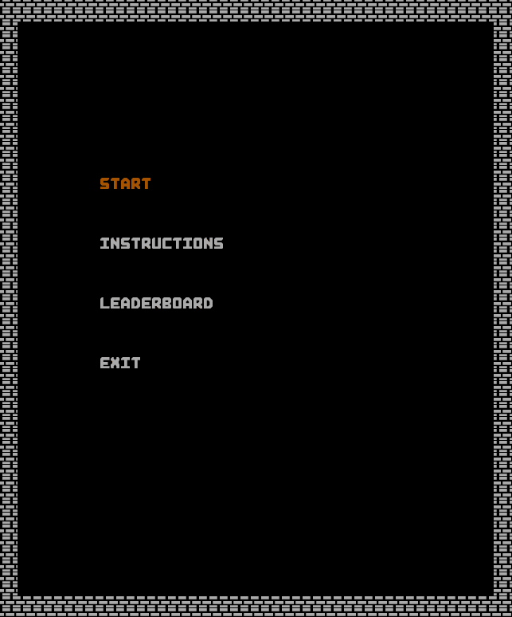
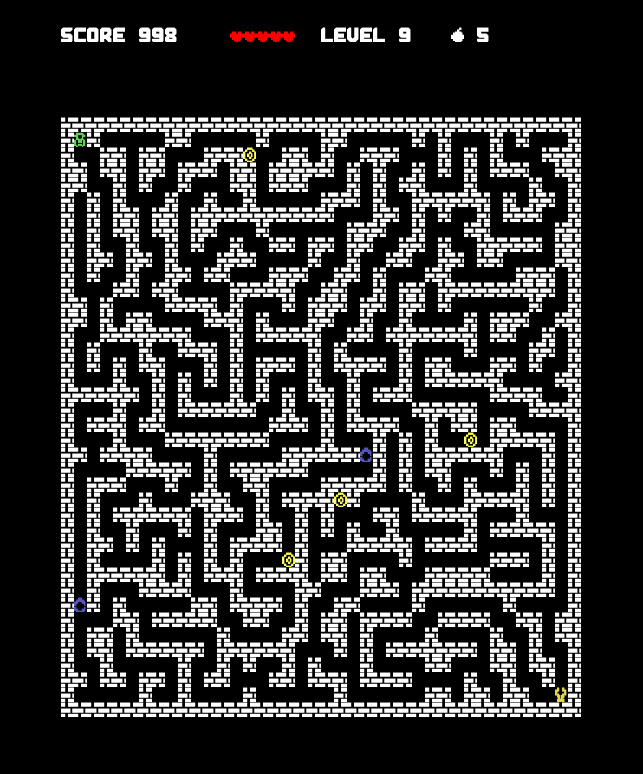
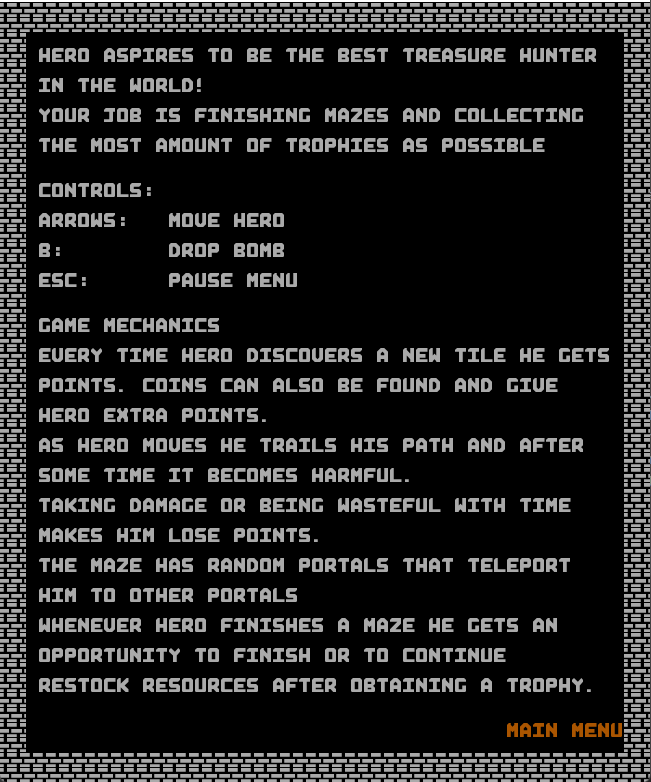
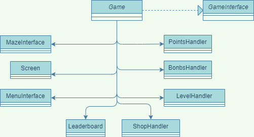
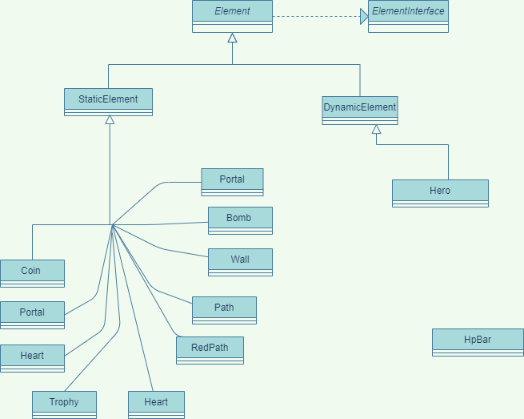
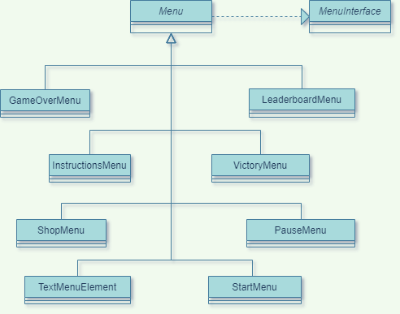
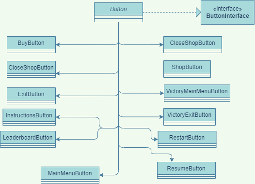

# LDTS_T01_G03 - Maze Conqueror

## Game Description

> The game consists of solving procedurally generated mazes as fast as possible while avoiding any obstacles in your path. Obstacles such as
> complicated paths, enemies and the impending red path, which stops backtracking, all make this exciting maze solving experience unique.

> This project was developed by *Eduardo Correia* (*up201909914*@fc.up.pt), *José Carvalho* (*up202005827*@fc.up.pt) and *Alberto Serra* (*up202103627*@fe.up.pt) for LDTS 2021-22.

## Screenshots / Gifs

The following screenshots illustrate and gifs the general look of our game, as well as the divergent functionalities:

### Start Menu

### Playing the game

### Pause menu

### Finishing the game

### Shop Menu

### Leaderboard Menu

### Instructions Menu

## Implemented Features

### Main Menu

> This section is in regard to the menu the player sees and interacts with when he starts up the game.

- **Start Game** - Allows the player to start the game.
- **Instructions** - Opens a new screen with info on how to play the game.
- **Exit** - Closes the game.

### Core Game

> This section details the features of the core gameplay.

- **Maze Generation** - Creates a new random maze with a reachable ending everytime the game is started.
- **Movement** - Allows the player to move the hero character.
- **Collision** - Prevents the player from phasing through unwanted elements of the game.
- **Trophy** - Reachable goal that dictates the ending of the game.
- **Pathing** - Highlights the path that the player took.
- **Hazardous Pathing** - Gradually transforms the path that the player took into a red path which, on contact, deals
  damage to the player.
- **Health** - The player's hit points, enables the player to take damage, and on reaching 0, finishes the game.
- **Pause** - Allows the player to pause the game.
- **Multithreaded Input** - The game does not stop and wait for player input.
- **Refactored Menus** - Hand-made menus that change the state of the game. These include, starting, pausing and finishing the game. Changed from default lanterna menu's.
- **Points** - The faster you complete the maze, the higher your points. Points are also acquired whenever you enter a new empty tile or pickup a coin.
- **Coins** - Randomly generated elements which, on contact give the player more points.
- **Portals** - Randomly generated elements which, on contact teleport the player to another portal on the maze.
- **Continue Playing** - Continue playing after completing the first maze (with a new randomly generated maze) in order
  to increase your total points. The game increases in difficulty after every level.

### Pause Menu

> This section details the features in regard to the pause menu.

- **Resume Game** - Allows the player to resume the game.
- **Restart** - Allows the player to restart the game.
- **Exit** - Closes the game.

### Game Over/Victory Menu

> This section details the features in regard to the Game Over/Victory menu. 
- **Continue** - Opens the shop to restock items. And allows the player to continue playing.
- **Main Menu** - Allows the player to return to the main menu.
- **Exit** - Allows the player to exit the game.

### Leaderboard Menu

> This section details the features in regard to the Leaderboard menu.
- **Leaderboard** - Highscore list that shows the best players.
- **Main Menu** - Allows the player to return to the main menu.

### Shop Menu

> This section details the features in regard to the Shop menu.
- **Shop** - Allows the player to restock resources such as bombs and health.
- **Unlockable Items** - Shop gains new items available for purchase after completing a certain amount of levels
- **Main Menu** - Allows the player to return to the main menu.

### Planned Features

> This section details the planned features for the game as a whole, that were not implemented.

- **Enemies** - Enemies with random movement that deal contact damage. This feature was not implemented due to the fact
that it conflicted with the gameplay we set ought to create. Enemies would only add a chaotic factor which would not be healthy to the project as a whole.

------
## Design

### General project development philosophy

#### Test Driven Mentality

 When possible, the project was designed with the test-driven development process, which consists on software requirements being converted to test cases before software is fully developed, a
 and tracking all software development by repeatedly testing the software against all test cases.

#### The four pillars of object-oriented programming

In general, the project was designed with the four pillars of object-oriented programming in mind :

- **Encapsulation** - Encapsulation is accomplished when each object maintains a private state, inside a class. Other objects can not access this state directly, instead, they can only invoke a list of public functions. The object manages its own state via these functions and no other class can alter it unless explicitly allowed.
- **Abstraction** - abstraction is an extension of encapsulation. It is the process of selecting data from a larger pool to show only the relevant details to the object.
- **Inheritance** - Inheritance is the ability of one object to acquire some/all properties of another object. With inheritance, reusability is a major advantage.
- **Polymorphism** - Polymorphism gives us a way to use a class exactly like its parent so there is no confusion with mixing types. This being said, each child sub-class keeps its own functions/methods as they are.

### The Core Game Loop

#### Problem in Context

The problem in question was figuring out what the game was currently doing and reacting by running code accordingly.

**The Pattern**

The Game class, responsible for all the interaction between classes, is defined by a **_Singleton
Pattern_**, ensuring that the class only has one instance and provide a global point to access it.

**Implementation**

To develop the project we decided that we were going to create a state machine for our main loop and use it to change the
program's behaviour.  We can switch to a different state of the application by changing the `gameState` variable.

Our State Machine relies on the game state or player actions to determine which state to go to next. The Main Menu
functions as a default state where many actions can be performed. These can depend on previous and current
inputs, as well as states.

Most other classes are also instantiated in this class, which makes the game class a primary reference to the other objects.

**Consequences**

The use of the **_Singleton_** in the current design allows the following benefits:

- Easy access and modification of the only instantiated game class.

These classes can be found in the following files:

- [Game](../src/main/java/game/Game.java)
- [GameInterface](../src/main/java/game/GameInterface.java)

#### Figuring out how to represent elements in the game.

**Problem in Context**

In our game, multiple elements like walls, paths and the player character exist, and we had to figure out a way to
represent them in a structured and efficient way.

**Pattern**

The main pattern applied specifically to the multiple elements was the
**_Factory Method Pattern_**, which is defined by an Element interface, used to create the Class object, but lets those
elements sub-classes decide which class they should instantiate.

**Implementation**

To resolve this issue we created the `Element` class which is a super class to represent all the various elements in our
game. Then we stored them in various data structures
(depending on efficiency). These stored structures are located on the `Maze` class which then handles their use and representation in the
game.

**Consequences**

The use of the **_Factory Method Pattern_** in the current design allows the following benefits:

- Easily obtain proprieties and status of all the elements present on the game.
- Avoid code smells due to repeating the same code multiple times.
- Can have multiple elements on the same position (which would be impossible if we represented the elements on a matrix
  for example).

These classes can be found in the following files:

- [Elements](../src/main/java/element)
- [Maze](../src/main/java/maze/Maze.java)

------

### Creating the various Menus

**Problem in Context**

A menu/user interface is required to interact and manipulate the games current status, for example to start the game or
exit it.

**Pattern**

The main pattern applied specifically to the menus was the **_State Pattern_**.

**Implementation**

We implemented the following menus : Game Over, Instructions, Leaderboard, Pause, Shop, Start, and Victory that are all child classes from the parent abstract class `Menu`.
Each menu contain several buttons that allow you to perform functions within the game. 

The menu object in the game class changes its behaviour depending on what state the game is running. This allows the application to simply change
states and load a new menu depending on the user's needs.

Every class present on the `submenu` package only contains code that instantiates buttons, and text elements (both child classes of `GenericMenuElement`) on specific positions. The functional methods are
present in the abstract class `Menu`.

**Consequences**

- Creating the `submenu` package allows easy creation of new menus

The use of the **_State Pattern_** in the current design allows the following benefits:

- Localizes and partitions behavior for different states.
- Makes state transitions explicit.

These classes can be found in the following files:

- [Menu](../src/main/java/menu/Menu.java)
- [submenu](../src/main/java/menu/submenu)

### Creating Buttons for use in the menus

**Problem in context**

After creating the menus we needed to create buttons which allowed the player to interact with the application.

**Pattern**

The main patterns applied specifically to the buttons was the
**_Factory Method Pattern_**, which is defined by a Button interface, used to create the Class object, but lets those
elements sub-classes decide which class they should instantiate, and the **_Strategy Pattern_** which defines a
family of algorithms, like the execute method, encapsulates each one and makes them interchangeable.

**Implementation**

To resolve this issue we created the `Button` abstract class which is a parent class to all the buttons.

This class implements the `ButtonInterface` Interface which contains the `execute()` method (among others).

The `execute()` function is called whenever the user presses enter on a selected button. This function is only actually
implemented in the child classes of `Button` which allows each button to have different behavior on execution while still re-using most 
of the implementation.

**Consequences**

The use of the **_Factory Method Pattern_** in the current design allows the following benefits
- Easy creation of new buttons
- Easily obtain proprieties and status of all the buttons
- Avoid code smells due to repeating the same code multiple times.

The use of the **_Strategy_** in the current design allows the following benefits:
- Eliminates conditional statements.
- Provides different implementations.

These classes can be found in the following files:

- [Abstract Button](../src/main/java/menu/Button.java)
- [Buttons](../src/main/java/menu/button)

### Handlers

**Problem in context**

Certain classes such as `Maze` and `Game` were responsible for handling code that they should not. So handler classes were created for
implementing code relating to managing their respective objects.

**Implementation**

Each handler is initialized in either the `Maze` or `Game` Class and is used to manipulate the properties and aspects of their respective objects.

Aspects such as hero health and portal interaction are all done through these handlers.

**Consequences**

- Cleaner `Maze` and `Game` classes.
- Able to maintain values after creating a new instance of `Maze` 

This class can be found in the following file:

- [Handler](../src/main/java/menu/button)

### Leaderboard

**Problem in context**

After completing a game, the current user id and points need to stored for later use.

**Implementation**

Every time the `Game` class is initialized (once per application startup) a user id is given based on the highest
id on the `data/leaderboard.txt` file. 

During application startup the data in the file is read and put on a `TreeMap<Integer,Integer>` which holds the player
id as a key and their respective points in the value.

After inserting the values into the map, this map is sorted by value so that we can simply get the first 10 
values whenever we want to load the leaderboard.

After winning a game, (specifically whenever a player clicks on the exit or main menu button) the leaderboard writes
the current score and id to the `data/leaderboard.txt` file.

This class can be found in the following file:

- [Leaderboard](../src/main/java/game/Leaderboard.java)

### Shop

**Problem**

Create a shop where the player can restock and buy resources after completing a game.

**Implementation**

Every action is possible with a single call the functions such as `sell()`, `increaseStock()`and`generalReStock()`.

Every item in the shop can have a custom `icon`, `name`,`price` and an optional `maximum value`.

These items will only be available for sale the player meets the requirements for purchasing said item
, for example to restore health the player must have the correct
amount of points and the player's current health needs to be lower than the maximum allowed.

When the player reaches level 10, the shop unlocks new items for sale and the previous listed items will be restocked.

This class can be found in the following file:

- [ShopHandler](../src/main/java/handler/ShopHandler.java)

### Maze/Other

#### Maze Representation

To generate a new maze, we use the `MazeGenerator` class, which gives us an integer matrix of 0's and 1's, that we then use to create
the elements needed for the game.

All static elements present in the game are also stored in the `Maze` class.

#### Data structures

Generally speaking whenever an element needed to be stored we tried to use the most efficient data structure for that
situation. With that said we usually opted to store elements in a `Linked List` instead of an `Array List`.

**Justification**

| Operation | Linked List | Array List |
|:---------:|:-----------:|:----------:|
|    add    |    O(1)     |    O(n)    |
|  remove   |    O(n)     |    O(n)    |
|    get    |    O(n)     |    O(1)    |

Knowing this table, the fact that we don't know, index wise, where elements are stored (which makes the `get()` method irrelevant) and the fact that we are always inserting new elements into the structure, the obvious choice was the `Linked List` structure.

------

### Deprecated

>This section list features that were implemented but were not used in the final application.

**Keyboard Listener**

This class was created with the intention of running on a different thread and reading the user's input as to not stop the rest of the application's
execution. However, this class was eventually replaced with the `lanterna.pollInput()` method which essentially did the same thing.

------

### Known code smells/problems and refactoring suggestions.

>This section list code smells and problems that we could identify in our application.

### Design problems

#### Using a single threaded code-flow

While discussing the project, the question of whether we should use a multithreaded approach was brought up.

At the beginning we thought this would be inevitable,
due to the fact that the `lanterna` `getInput()` method interrupts the processing of the code, much like a system input function. So we developed a `KeyboardListener`
class which would run on a separate Thread. This class would queue up the inputs read from the user, without interrupting the code. We managed to circumvent this issue however, using the `screen.pollInput()` which
essentially did the same thing.

Another instance we thought of using threads was with the handler package. The classes present within this class are currently are instantiated on the `Maze` and `Game` class. 

The idea of handling certain aspects of the game in an asynchronous manner, at first did look appealing, yet this brought up the question of what would happen if established classes where modified in an
unordered manner, which would wind up introducing unwanted problems. So we decided to run everything on a single, timed thread, running currently at 30 frames per second.

#### Wrong data structure

The `Heart` element is currently stored in a `ArrayList`, which is not as efficient as storing it in a stack, for our
use case. This is due to the implementation of the `remove()` method in the `List` class which has a complexity
of `O(n)`. 

Comparatively speaking, the `pop()` method in a `Stack` has a complexity of `O(1)`.

Change the code to accept `Hearts` in a `Stack` instead of a `ArrayList`.

-----

### Code Smells

#### Large Class

**Problem**

Currently, the `Game` class is responsible for too much code, handling game elements that should be outside of its
reach.

**Solution**

Refactor certain sections of code to be in a different class.

-----

#### **Long Method**

**Problem**

Currently, the constructor for the `Maze` class is too big, which is simply due to the great amount of variables this class.

**Solution**

Create more functions to divide the code and make it more readable. This, however, would only replace the current problem
with a Long Class code smell.

------
#### **Long Method**

**Problem**

Currently, the constructor for the `Game` class is too big, which is simply due to the great amount of variables this class.

**Solution**

Create more functions to divide the code and make it more readable. This, however, only propagates the Large class code
smell that exists within this class.

------

#### **Long Parameter List**

**Problem**

Some element constructors take 4 or 5 parameters per constructor. This happens because we are taking in 
unnecessary arguments such as the element's character and format when we could simply have them as final variables in the class.

**Solution**

Change these variables to be final and initialize them outside the constructor.

----

#### **Long Method**

**Problem**

The `InstructionsMenu` class in the `submenu` package is really overwhelming size-wise because, we need to create
multiple text elements in many positions which is done by creating many objects. 

**Solution**

Create these elements in a separate data file.

----

#### **Feature envy**

**Problem**

All handlers suffer from the feature envy code smell. This is because they handle and interact with objects that
were initialized outside their own class.

**Solution**

Initialize the handled objects in these classes.

----

#### **Switch Statements**

**Problem**

Currently, the `checkTile()` function in the `Maze` class consists of nested if's which is not good practice for adding new 
features.

**Solution**

Change the function to a state pattern design.

----
### TESTING

> We currently have 200 tests which give us the following coverage

Unit testing was the strategy chosen in order to test individual units of the game to obtain the expected behavior of the application.
To achieve this purpose, the use of JUnit and Jqwik was fundamental.

Overall, the team chose to focus on massive testing and later, with the application of some Property Based Testing concepts, allowed the end result to be a very complete test suite with good coverage.
### Self-Evaluation

- Eduardo Correia: 33.3%
- José Carvalho: 33.3%
- Alberto Serra: 33.3%
