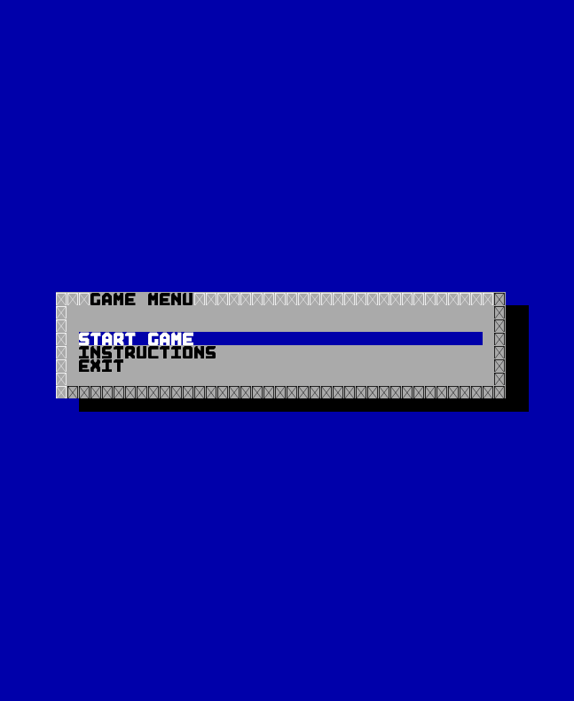
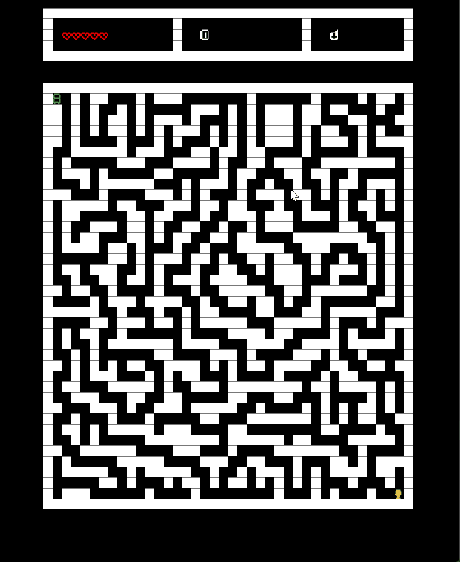

# LDTS_T01_G03 - Maze Conqueror

## Game Description

> The game consists of solving procedurally generated mazes as fast as possible while avoiding any obstacles in your path. Obstacles such as
> complicated paths, enemies and the impending red path, which stops backtracking, all make this exciting maze solving experience unique.

> This project was developed by *Eduardo Correia* (*up201909914*@fc.up.pt) and *José Carvalho* (*<insertemailplease>*@fc.up.pt) and *Alberto Serra* (*<insertemailplease>*@fe.up.pt) for LDTS 2021-22.

## Screenshots / Gifs

The following screenshots illustrate and gifs the general look of our game, as well as the divergent functionalities:

### Start Menu

### Playing the game

### Pause menu

### Finishing the game

## Implemented Features

### Main Menu

>This section is in regard to the menu the player sees and interacts with when he starts up the game. The current visual aspect is a WIP.
- **Start Game** - Allows the player to start the game.
- **Instructions (WIP)** - Opens a new screen with info on how to play the game.
- **Exit** - Closes the game.

### Core Game
>This section details the features of the core gameplay.
- **Maze Generation** - Creates a new random maze with a reachable ending everytime the game is started.
- **Movement** - Allows the player to move the hero character.
- **Collision** - Prevents the player from phasing through unwanted elements of the game.
- **Trophy** - Reachable goal that dictates the ending of the game.
- **Pathing** - Highlights the path that the player took.
- **Hazardous Pathing** - Gradually transforms the path that the player took into a red path which, on contact, deals damage to the player.
- **Health** - The player's hit points, enables the player to take damage, and on reaching 0, finishes the game.
- **Pause** - Allows the player to pause the game.

### Pause Menu
>This section details the features in regard to the pause menu. The current visual aspect is a WIP.
- **Resume Game** - Allows the player to resume the game.
- **Restart** - Allows the player to restart the game.
- **Exit** - Closes the game.

### PLANNED FEATURES

>This section details the planned features for the game as a whole. These may be subject to change as we develop the project.

- **Multithreaded Input** - Currently the game runs on a single thread. This is not acceptable due to the fact that the getInput method from lanterna stops the process from running, which prevents time based mechanics. Currently there's a WIP branch that gets input from another thread.
- **Refactor the Menus** - The current menus are pre-made from the lanterna library which are incompatible with the threaded KeyboardListener class (in WIP branch). As such these will have to be remade in order to account for these incompatibilities.
- **Points** - Finish the game with a certain amount of points, the faster you complete the maze, the higher your points. Points are also acquired whenever you enter a new empty tile.
- **Continue Playing** - Continue playing after completing the first maze (with a new randomly generated maze) in order to increase your total points. The maze may increase in difficulty.
- **Enemies** - Add enemies with random movement that deal contact damage.
- **Portals** - Static elements which, on contact teleport the player to another portal on the maze. 
- **Other Special Elements** - Special elements which cause different effects on contact, these are still in discussion. 
- **Items** - Special items that can be acquired that interact with the maze in some way.

### DESIGN

> This section should be organized in different subsections, each describing a different design problem that you had to solve during the project. Each subsection should be organized in four different parts:

- **Problem in Context.** The description of the design context and the concrete problem that motivated the instantiation of the pattern. Someone else other than the original developer should be able to read and understand all the motivations for the decisions made. When refering to the implementation before the pattern was applied, don’t forget to [link to the relevant lines of code](https://help.github.com/en/articles/creating-a-permanent-link-to-a-code-snippet) in the appropriate version.
- **The Pattern.** Identify the design pattern to be applied, why it was selected and how it is a good fit considering the existing design context and the problem at hand.
- **Implementation.** Show how the pattern roles, operations and associations were mapped to the concrete design classes. Illustrate it with a UML class diagram, and refer to the corresponding source code with links to the relevant lines (these should be [relative links](https://help.github.com/en/articles/about-readmes#relative-links-and-image-paths-in-readme-files). When doing this, always point to the latest version of the code.
- **Consequences.** Benefits and liabilities of the design after the pattern instantiation, eventually comparing these consequences with those of alternative solutions.

**Example of one of such subsections**:

------

#### THE JUMP ACTION OF THE KANGAROOBOY SHOULD BEHAVE DIFFERENTLY DEPENDING ON ITS STATE

**Problem in Context**

There was a lot of scattered conditional logic when deciding how the KangarooBoy should behave when jumping, as the jumps should be different depending on the items that came to his possession during the game (an helix will alow him to fly, driking a potion will allow him to jump double the height, etc.). This is a violation of the **Single Responsability Principle**. We could concentrate all the conditional logic in the same method to circumscribe the issue to that one method but the **Single Responsability Principle** would still be violated.

**The Pattern**

We have applied the **State** pattern. This pattern allows you to represent different states with different subclasses. We can switch to a different state of the application by switching to another implementation (i.e., another subclass). This pattern allowed to address the identified problems because […].

**Implementation**

The following figure shows how the pattern’s roles were mapped to the application classes.

These classes can be found in the following files:

- [Character](https://web.fe.up.pt/~arestivo/page/courses/2021/lpoo/template/src/main/java/Character.java)
- [JumpAbilityState](https://web.fe.up.pt/~arestivo/page/courses/2021/lpoo/template/src/main/java/JumpAbilityState.java)
- [DoubleJumpState](https://web.fe.up.pt/~arestivo/page/courses/2021/lpoo/template/src/main/java/DoubleJumpState.java)
- [HelicopterState](https://web.fe.up.pt/~arestivo/page/courses/2021/lpoo/template/src/main/java/HelicopterState.java)
- [IncreasedGravityState](https://web.fe.up.pt/~arestivo/page/courses/2021/lpoo/template/src/main/java/IncreasedGravityState.java)

**Consequences**

The use of the State Pattern in the current design allows the following benefits:

- The several states that represent the character’s hability to jump become explicit in the code, instead of relying on a series of flags.
- We don’t need to have a long set of conditional if or switch statements associated with the various states; instead, polimorphism is used to activate the right behavior.
- There are now more classes and instances to manage, but still in a reasonable number.

#### KNOWN CODE SMELLS AND REFACTORING SUGGESTIONS

> This section should describe 3 to 5 different code smells that you have identified in your current implementation, and suggest ways in which the code could be refactored to eliminate them. Each smell and refactoring suggestions should be described in its own subsection.

**Example of such a subsection**:

------

#### DATA CLASS

The `PlatformSegment` class is a **Data Class**, as it contains only fields, and no behavior. This is problematic because […].

A way to improve the code would be to move the `isPlatformSegmentSolid()` method to the `PlatformSegment` class, as this logic is purely concerned with the `PlatformSegment` class.

### TESTING

- Screenshot of coverage report.
- Link to mutation testing report.

### SELF-EVALUATION

- Eduardo Correia: 33.3%
- Jose Carvalho: 33.3%
- Alberto Serra: 33.3%
